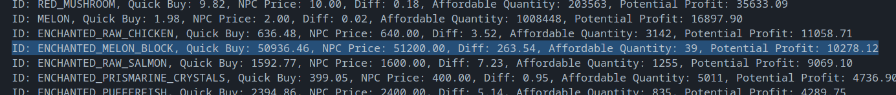
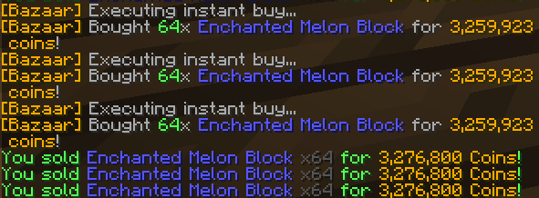

# Hypixel Skyblock NPC Price To Bazaar Price Comparator

Simple python script that checks bazaar prices against a list of NPC sell prices to find profitable items to flip.

### Example: 


A whole 16,877 coins profit per stack!



## Usage 
```
$ python compare.py
Enter the amount of coins you have (press Enter to skip): 50,000,000
Enter the upper limit of items to buy (press Enter to skip): 1500

Potential Undercut Items:
ID: ENCHANTED_MELON_BLOCK, Quick Buy: 50936.47, NPC Price: 51200.00, Diff: 263.53, Affordable Quantity: 981, Potential Profit: 258521.37
ID: POLISHED_PUMPKIN, Quick Buy: 255707.90, NPC Price: 256000.00, Diff: 292.10, Affordable Quantity: 195, Potential Profit: 56959.50
ID: ENCHANTED_SULPHUR_CUBE, Quick Buy: 255732.15, NPC Price: 256000.00, Diff: 267.85, Affordable Quantity: 195, Potential Profit: 52231.51
ID: ENCHANTED_HUGE_MUSHROOM_2, Quick Buy: 51196.17, NPC Price: 51200.00, Diff: 3.83, Affordable Quantity: 976, Potential Profit: 3733.99
ID: ENCHANTED_SLIME_BLOCK, Quick Buy: 128000.00, NPC Price: 128000.00, Diff: 0.00, Affordable Quantity: 390, Potential Profit: 0.48

5 items found
20 items were omitted due to the upper limit
```

## helper.py
The NPC price helper is a simple script that scrapes the Hypixel Skyblock wiki for NPC sell prices and saves them to a json file. This is used by compare.py to find profitable items to flip.
It's simply called by running `python helper.py` and will save the NPC prices to `npc_prices.json` in the same directory. For your convenience, the latest version of this file is included in this repository.

